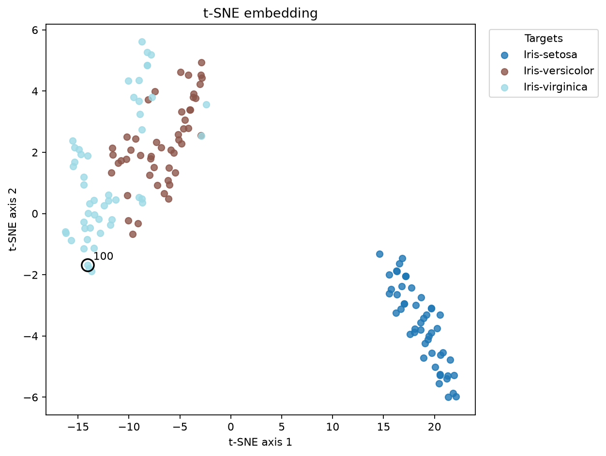
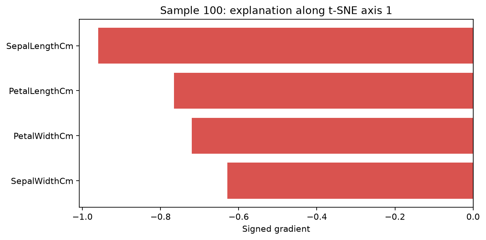

# t-SNE Explanations in C++

[](https://isocpp.org/)
[](LICENSE)

This repository provides a C++17 implementation of exact t-SNE together with
the gradient-based explanation method described in the paper cited below. The
method estimates the local influence of each input feature on the position of
a sample in a two-dimensional t-SNE embedding.

It builds two command-line programs:

- `tsne` computes an exact t-SNE embedding and the probability matrices needed
  by the explainer.
- `tsne_explainer` computes a local gradient for every embedded sample and
  input feature.

The C++ code has no required third-party dependencies. It uses OpenMP when
available and falls back to a single thread otherwise.

This is an experimental research implementation. Its suitability should be
assessed independently before use in consequential applications.

## Requirements

- A C++17 compiler (GCC, Clang, AppleClang, or MSVC)
- CMake 3.16 or newer
- OpenMP and Ninja are optional
- Python 3.9 or newer for the CSV and plotting workflow

## Build

Configure and build the project with CMake:

```sh
cmake -S . -B build -DCMAKE_BUILD_TYPE=Release
cmake --build build --config Release
```

With Clang and Ninja:

```sh
cmake -S . -B build/clang -G Ninja -DCMAKE_CXX_COMPILER=clang++ -DCMAKE_BUILD_TYPE=Release
cmake --build build/clang --parallel
```

Alternatively, use the included Ninja preset:

```sh
cmake --preset release
cmake --build --preset release
```

To install the executables:

```sh
cmake --install build --config Release --prefix ./install
```

On multi-configuration generators such as Visual Studio, executables are
usually placed in `build/Release`. On Makefiles and Ninja they are normally in
`build`.

## Running a CSV dataset

The Python runner provides the main workflow for headered datasets. It reads a
CSV file, separates an optional label column, standardizes the numeric
features, runs both C++ programs, and writes the embedding, gradients, and
plots. Comma, semicolon, and tab delimiters are detected automatically.

Install its dependencies:

```sh
python -m pip install -r requirements-visualization.txt
```

Run the bundled Iris dataset as follows:

```sh
python tools/run_and_visualize.py \
  --input examples/iris.csv \
  --label-column Targets \
  --standardize \
  --perplexity 30 \
  --iterations 400 \
  --binary-dir build \
  --output-dir results/iris \
  --sample 100
```

Use the directory where CMake placed the executables for `--binary-dir`. For
the default build command this is `build`; for the Ninja example it is
`build/clang`, or `build/release` when using the preset. Visual Studio's `Release`
subdirectory is detected automatically.

The example uses Unix-style line continuations. In PowerShell, put the command
on one line or replace each trailing `\` with a backtick.

The main outputs are:

- `embedding.csv` and `embedding.png`
- `gradients.csv`, with feature names in the column headers
- `global_feature_importance.png`
- `sample_<index>_explanation.png`
- `sample_<index>_axis_1_explanation.png` and
  `sample_<index>_axis_2_explanation.png`

The output directory also contains the intermediate matrices produced by the
C++ programs.

## Iris example

The Iris embedding uses standard scaling, perplexity 30, and 400 iterations.
Sample 100 is highlighted and explained along the first embedding axis.

| Iris embedding with sample 100 highlighted | Signed axis-specific explanation |
| --- | --- |
|  |  |

Run `python tools/run_and_visualize.py --help` for the complete option list.
Perplexity is chosen automatically when omitted. Standard scaling is enabled
by default; use `--no-standardize` to retain the original feature values. A
delimiter can be specified explicitly, for example `--delimiter ";"`.

## Direct C++ usage

The direct C++ tools expect a numeric, comma-separated file without a header,
label, or index column. Each row is a sample and each column is a feature.

Run exact t-SNE:

```sh
./build/tsne path/to/X.csv 30 out/example --iterations 400
```

The general form is `tsne X.csv perplexity output_prefix [options]`. Use
`--help` for the complete option list. By default, the two-dimensional
initialization is generated with seed `42`; a custom initialization can be
passed with `--init`.

This writes `out/example_Y.csv`, `out/example_P.csv`,
`out/example_Q.csv`, and `out/example_sigma.csv`. Missing output directories
are created automatically.

Then compute explanations:

```sh
./build/tsne_explainer \
  path/to/X.csv \
  out/example_Y.csv \
  out/example_P.csv \
  out/example_Q.csv \
  out/example_sigma.csv \
  out/example_gradients.csv
```

For `D` input features, the explainer writes `2D` columns. The first `D` are
gradients along embedding axis 1 and the remaining `D` are gradients along
axis 2.

See [examples/README.md](examples/README.md) for the bundled Iris workflow.

## Interpreting gradients

For a sample `i`, the gradient has shape `2 x D`. A large absolute value means
that the embedded position is locally sensitive to that feature. The sign
gives the direction along one embedding axis. Since a t-SNE map may rotate or
reflect, feature rankings are more stable when based on the norm across both
axes:

```text
importance(feature k) = sqrt(g_axis1[k]^2 + g_axis2[k]^2)
```

These values measure local sensitivity and should not be interpreted as causal
effects.

For global feature ranking, the implementation follows Equation (9) of the
paper. Each sample's feature magnitudes are first normalized so they sum to
one, and the normalized values are then averaged across samples:

```text
global_importance(k) = mean_i(
    magnitude(i, k) / sum_j(magnitude(i, j))
)
```

This per-sample normalization avoids comparing raw gradient scales across
different samples.

In the axis-specific plots, blue bars point in the positive direction and red
bars in the negative direction. The orientation of a t-SNE map is arbitrary,
so use the combined magnitude plot when comparing separate runs.

## Limitations

- Exact t-SNE has `O(N^2)` time and memory requirements. This implementation is
  intended for small and medium datasets.
- The explainer currently supports two-dimensional embeddings only.
- CSV parsing accepts numeric, comma-separated values only; headers, labels,
  missing values, and quoted fields are not supported by the direct C++ tools.
  The Python runner handles headers and a label column.
- Perplexity must be positive and smaller than the number of samples.
- The Python workflow standardizes features by default. Its explanations are
  therefore gradients with respect to standardized feature values, not the
  original measurement units. Use `--no-standardize` when explanations in the
  raw feature space are required and the feature scales are already suitable.
- The analytical method includes a 2x2 Hessian inversion and can be sensitive
  to ill-conditioned embeddings, as discussed in the paper.

## Development note

Generative AI was used while writing parts of the code and documentation.

## License

MIT. See [LICENSE](LICENSE).

## References

The explanation method implemented in this repository is described in:

- S. Corbugy, R. Marion, and B. Frénay,
  [Gradient-based explanation for non-linear non-parametric dimensionality reduction](https://doi.org/10.1007/s10618-024-01055-6),
  *Data Mining and Knowledge Discovery* 38, 3690-3718 (2024).

This C++ implementation is based on the original Python project:

- [sady410/tsne_gradients_explanation](https://github.com/sady410/tsne_gradients_explanation)

GitHub can generate citation formats directly from [CITATION.cff](CITATION.cff).
